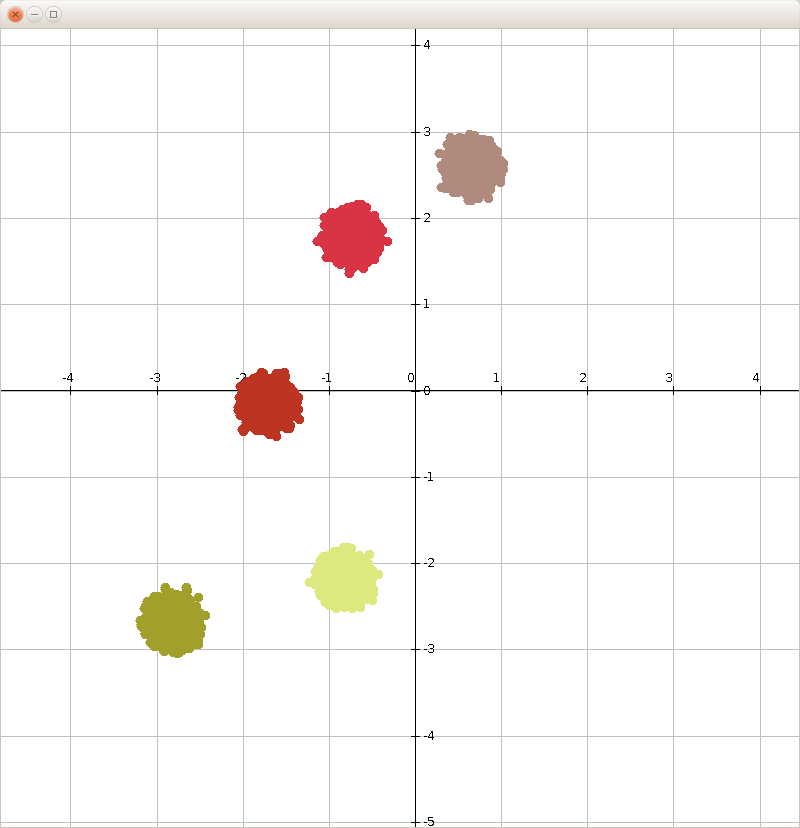

# Grouping
Genericaly implemented basic grouping algorithms. 

This repository offers a generic implementation of basic grouping algorithms. 
The main idea behind this repository is to serve as education material for all those interested in grouping algorithms.

 This project offers implementations of the following algorithms:
 * KMeans
 
 ## Use of the library
 
 Let's say you wish to group some 2D data and have decided to use KMeans as a grouping method. 
You have decided to use the following strategies:
* SOLUTION REPRESENTATION: double array
* INITIAL CENTROID SELECTION: sparsed out
* CENTROID UPDATER: based on group affiliation
* DISTANCE CALCULATION: Euclidian

You would do this in the following way:
```java
//Initial Centroid Selection
IInitialCentroidSelection<DoubleArraySolution> centroidSelection = new SpreadOutInitialCentroidSelection<>();

//Iteration grouping
SimpleDistanceIterationGrouping<DoubleArraySolution> iterationGrouping = new SimpleDistanceIterationGrouping<>();

//Centroid updater
double centroidChangeLimit = 1e-3;
ICentroidUpdater<DoubleArraySolution> centroidUpdater = new GroupingBasedCentroidUpdater(centroidChangeLimit);

//Distance calculator
IDistanceCalculator<DoubleArraySolution> distanceCalculator = new EuclidianDistanceCalculator();

//Grouping algorithm
IGrouping<DoubleArraySolution> grouping = new KMeansGrouping<DoubleArraySolution>(centroidSelection, 
        iterationGrouping, centroidUpdater, distanceCalculator);

//Run algorithm
int[] groups = grouping.group(elements, groupCount);
```

## Examples

In the examples source folder you can find several usage examples.

